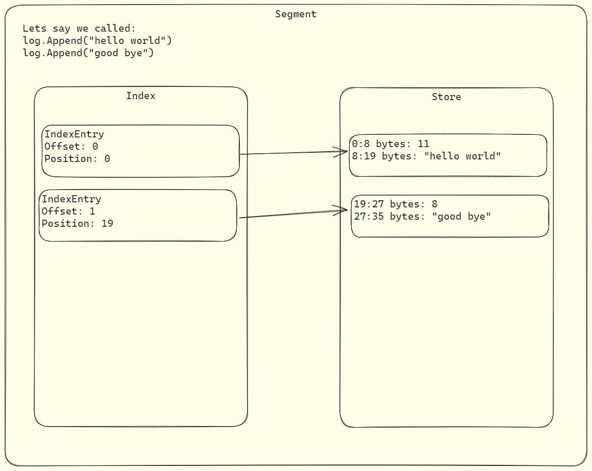

# Distributed Log System

## Core Components

Record - the data stored in our log.

Store - the file we store records in.

Index - the file we store index entries in.

Segment - the abstraction that ties a store and an index together.

Log - the abstraction that ties all the segments together.




## Dev Env

Install `protoc`.

```
apt install -y protobuf-compiler
```

Install Go plugins for protocol compiler.

```
go install google.golang.org/protobuf/cmd/protoc-gen-go@v1.28
go install google.golang.org/grpc/cmd/protoc-gen-go-grpc@v1.2
```

Install `cfssl`.

```
go install github.com/cloudflare/cfssl/cmd/...@latest
```

## Observe

### Metrics

There are three kinds of metrics:

*Counters*

Counters track the number of times an event happened, such as the number for requests that failed or 
the sum of some fact of your system like the number of bytes processed. Counters are often used to 
calculate a rate, the number of times an event happened in an interval.

*Histograms*

Histograms show you a distribution of your data. You'll mainly use histograms for measuring the percentiles of your request duration and sizes.

*Gauges*

Gauges track the current value of something. You can replace that value entirely. Gauges are useful for saturation-type metrics, like a host's disk usage percentage or the number of load balancers compared to your cloud provider's limits.


What to measure? Here are Google's 4 golden sigals:

1. Latency - the time it takes your service to process requests.
1. Traffic - the amount of demand on your service.
1. Errors - failure rate. 
1. Saturation - a measure of your service's capacity.


### Structured Logs

A structured log is a set of name and value ordered plairs encoded in consistent schema and format that's easily read by programs.

### Traces

Traces capture request lifecycles and let you track requests as they flow through your system. Tools like Jaegar, Strackdriver, and Lightstep help with this.

You can tag your traces with details to know more about each request. A common example is tagging each trace with a user ID so that if users experience a problem, you can easily find their requests.

## Service Discovery

Two service discovery problems to solve:

- How will the servers in our cluster discover each other?
- How will the clients discover the servers?

### Embed Service Discovery

Sevice discovery tools need to perform the following tasks:

- manage a registry of services containing info such as their IPs and ports;
- help services find other services using the registry
- health check service instances and remove them if they're not well
- deregister services when they go offline

For our service, we'll use [Serf](https://github.com/hashicorp/serf).

To implement service discovery with Serf we need to:

1. Create a Serf node on each server.
1. Configure each Serf node with an address to listen on and accept connections from other Serf nodes.
1. Configure each Serf node with addresses of other Serf nodes and join their cluster.
1. Handle Serf's cluster discovery events, such as when a node joins or fails in the cluster.
